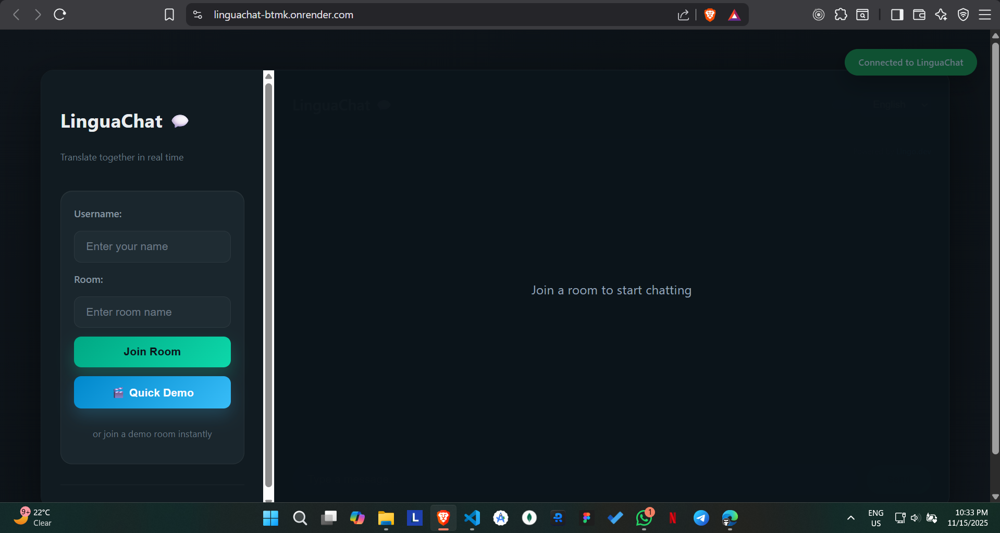
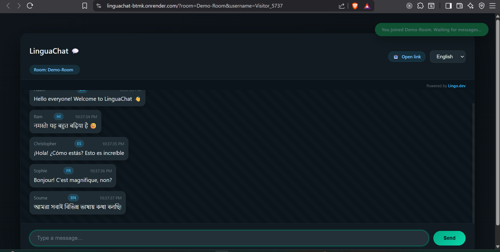
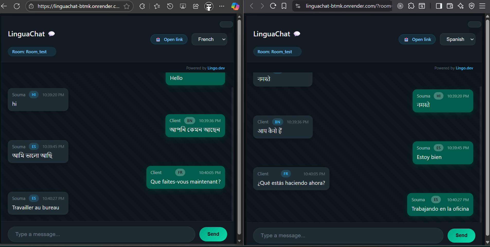

# 🚀 LinguaChat

### _Translate together in real time — chat across languages effortlessly._


---

## 🌍 Overview

**LinguaChat** is a real-time multilingual chat platform. Built with **Node.js**, **Express**, **Socket.IO**, and **Lingo.dev AI Translation**, it enables people speaking different languages to chat in the same room with automatic message translation.

---

## ✨ Features

- 🔗 Join rooms or share invite links using `?room=&username=`
- 🌐 Real-time translation to each user’s preferred language
- 👥 Presence panel with usernames and language tags
- 🔄 Auto reconnection for stable chat sessions
- 🕒 In-memory message history (last 50 messages)
- 🛠️ `/health` API route plus automated tests
- 🎨 Clean WhatsApp-style responsive UI

---

## 🧰 Tech Stack

**Backend:** Node.js, Express, Socket.IO, Lingo.dev SDK, dotenv
**Frontend:** HTML, CSS, JavaScript, Socket.IO client
**Testing:** Node built-in test runner (`node --test`)
**Deployment:** Render Web Service

---

## 📁 Folder Structure

```
LinguaChat/
│
├── Backend/
│   ├── index.js
│   ├── package.json
│   ├── .env
│   ├── .env.example
│   ├── tests/
│   │   └── health.test.js
│   └── node_modules/
│
├── Frontend/
│   ├── index.html
│   ├── style.css
│   ├── script.js
│   └── node_modules/
│
├── assets/
│   └── screenshots/
│       ├── Landing.png
│       ├── Demo_room.png
│       └── Multillingual_chat.png
│
└── README.md
```

---

## 🛠️ Local Setup

1. **Install dependencies**
   ```bash
   cd Backend
   npm install
   ```
2. **Configure environment variables** — create `Backend/.env`
   ```env
   LINGO_API_KEY="your_api_key_here"
   ```
   Optional override:
   ```env
   LINGO_API_URL="custom_api_url"
   ```
3. **Start the server**
   ```bash
   npm run dev
   ```
   Visit <http://localhost:5000> to join or create a room.

---

## 🧪 Tests

```bash
npm test
```

Verifies the `/health` route responds with `{ "status": "ok" }`.

---

## ☁️ Deploying to Render

1. Push to the `main` branch.
2. Create a Render **Web Service** with:
   - **Root Directory:** `Backend`
   - **Build Command:** `npm install`
   - **Start Command:** `npm start`
3. Configure environment variables:
   - `LINGO_API_KEY`
   - (Optional) `NODE_VERSION=20`
4. Deploy 🚀

Shareable invite example:

```
https://yourapp.onrender.com?room=demo&username=Souma
```

---

## 📸 Screenshots

| Landing Screen                             | Demo Room                                      | Cross-Language Chat                                             |
| ------------------------------------------ | ---------------------------------------------- | --------------------------------------------------------------- |
|  |  |  |

---

## 🚀 Future Improvements

- Persistent database (MongoDB or PostgreSQL)
- Typing indicators and read receipts
- Message reactions and emoji picker
- Light/dark theme toggle
- User authentication and profiles
- Analytics dashboard for room activity

---

## 💬 Final Note

LinguaChat was built to make global communication effortless. Feel free to fork, extend, or use it as a starting point for your own multilingual chat experience.

Happy hacking! 🚀

## 📁 Video Demo


https://github.com/user-attachments/assets/173b8324-d75b-4d15-a375-d0b32ced0e80


